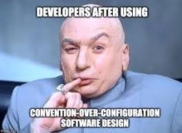

---
# Page settings
layout: default
head_title: Unit 1 Chapter 1
keywords:
comments: false

# Hero section
title: Chapter 1 Getting Started with Tools
description: In this chapter you will begin learning about selecting tools for a software development environment.

# Micro navigation
micro_nav: true

# Page navigation
page_nav:
    prev:
        content: Unit 1
        url: '/u1/'
    next:
        content: Project 1
        url: '/u1/p1/'
---

# Getting Started with Tools
A Software Development Environment is a combination of tools used to automate and augment the software development process. Selection of tools is an important first step in beginning the Software Development Life Cycle. 

JavaScript development tools are constantly change and it is important to continually be researching new tools.

## Getting Started with Research

Staying up to date on all the latest tools can be tough. Most of the time the JS developer community is the best source for trends and discovering new tools. The following resources are good places to start when doing your homework.

- [State of JS](https://stateofjs.com/)
- [DEV](https://dev.to/)
- [Medium](https://medium.com)
- [YouTube](https://youtube.com)

# Convention vs Configuration

One of the toughest decisions to make when selecting a tool is convention vs configuration. Tools that follow conventions are easier to setup, because they replace optional features with predetermined conventions. Tools that allow for advanced configuration are more flexible but require considerable knowledge and time to get working. All tools will share elements of convention and configuration.

A good philosophy is to always choose convention over configuration. The goal of software development is to ship working software. Configuring tools is time consuming and maintenance intensive and often interferes with delivering software in a timely manner. The less time you can spend working on your tools; the more time you have to actually build your software.

# Popular JavaScript Tools

The following list will introduce you to the various tools available. The list is not intended to be extensive, but it is a place to get started.

### Code Editor
A code editor is an essential part of any Software Development Environment. 

Some code editors to consider:

- Visual Studio Code
- Atom
- WebStorm
- Vim

### Package Management

- NPM
- Yarn

### Bundling

- Web Pack
- Parcel
- Next.js

### Preprocessors

- SASS

### Transpiling

- Babel
- TypeScript

### Linting

- ESLint

### Component Libraries

- Ant
- MaterialUI
- Bulma

### Testing

- Jest
- Mocha
- Jasmine
- Karma
- Puppeteer

### Continuous Integration/Deployment

- Travis CI
- Jenkins
- CircleCI
- Docker
- DeployBot

### Mobile/Desktop

- Electron
- React Native