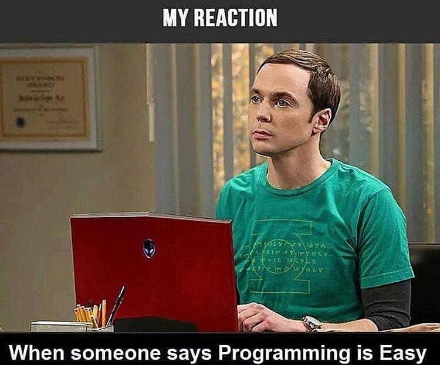

---
# Page settings
layout: default
keywords:
comments: false

# Hero section
title: Unit 1
description: >
    In this unit you will be exploring various software development environments. We will focus on JavaScript tooling, which is chaotic and constantly changing.

# Micro navigation
micro_nav: false

# Page navigation
page_nav:
    next:
        content: Chapter 1
        url: '/u1/ch1'
---

# Overview

Software development is a complex process that involves a lot of craftsmanship and experience. You will be learning about Software Development environments in this unit, and you'll get some experience selecting tools for your own development environment. Setting up and working with new tools is not easy, but it gets better with experience.

## Table of Contents

| Chapter                     | Description                                          |
| --------------------------- | ---------------------------------------------------- |
| [Chapter 1](ch1)            | Compare and contrast various tools for writing code. |
| [Chapter 2](ch2)            |                                                      |
| [Presentation Project](p1)  |                                                      |
| [Chapter 3](ch3)            |                                                      |
| [Chapter 4](ch4)            |                                                      |
| [Chapter 5](ch5)            |                                                      |
| [Personal Blog Project](p1) |                                                      |

## Objectives

- Compare and contrast various tools used to create a software development environment.

## TN Standards

- Evaluate at least two software development environments (SDEs) that are tailored to different programming languages on the basis of their suitability for a range of programming tasks, ease of use, and how ubiquitous they are within the IT community.    Document in an oral presentation the similarities and differences between the two, and the features that lend themselves to the chosen programming languages. For example, students assigned to code a basic database interface can compare the benefits and features of a freeware SDE such as JDeveloper and a commercial SDE like Microsoft Visual Studio. *[Standard 1]*
- Investigate the typical process around creating new software within a software development environment. Describe and furnish examples of the steps taken within the SDE to guarantee reliable output, from prototyping and authoring to deployment and debugging. *[Standard 2]*
- Administer the process of creating new software within a software development environment to manage the prototyping, authoring, revising, compiling, testing, deploying, and debugging of student-developed software. For example, for an object-oriented payroll program assignment (retrieving file data to produce a run of paychecks and paystubs for a small business), perform and document the steps taken within the SDE to ensure the reliable and accurate output of paychecks. *[Standard 3]*