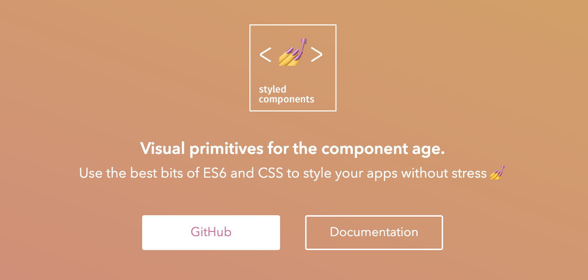

---
# Page settings
layout: default
head_title: Unit 1 Project 3
keywords:
comments: false

# Hero section
title: Project 3 Todo List App
description: In this project you will get some practice using your software development environment to create a starter app.

# Micro navigation
micro_nav: true

# Page navigation
page_nav:
    prev:
        content: Project 2
        url: '/u1/p2/'
---

# Todo List App

In this project, you are going to create Todo List app to get some more practice with your Software Development Environment. You will have 3 days to complete the project and customize it. Todo list apps are a pretty typical first app to learn the normal flow of a new langauge or framework.

## Video Tutorial

Watch the video below to guide you through creating a basic Todo List app using the latest React frameworks. It moves pretty fast, so feel free to pause and rewind. **Do not just pause and look at code! You will learn nothing.**

<iframe style="max-width:640px" width="100%" height="360" src="https://www.youtube.com/embed/hQAHSlTtcmY" frameborder="0" allow="accelerometer; autoplay; encrypted-media; gyroscope; picture-in-picture" allowfullscreen></iframe>

Here's the source code for the project from the video. Use the source wisely. It can help you if you get stuck, but it does you no good to just copy.

<a href="https://github.com/WebDevSimplified/Learn-React-In-30-Minutes" class="btn btn--dark btn--rounded btn--w-icon"><i class="icon icon--github"></i>Source Code</a>

## Customize Your App

After you get the basic app working from the video, choose at least one way to make the app your own by styling your app.

### Styled Components

[Styled compenents](https://styled-components.com/docs) are an easy way to implement custom styles for your components. You can write plain CSS in your component javascript files. Checkout the documentation for more information.

### Component Libraries

Explore other component libraries like Material UI or Ant that you could potentially use in your app. Weigh the benefits of of the app versus the cost of complexity and size of the includes.

# Deliverables

  
<strong><b>Deliverable</b> - Todo App</strong>

  
You will 

  <ol>
    <li>Open the following link to create a repository for the project: <a href="https://classroom.github.com/a/xPRbBEmn">GitHub Classroom Assignment</a></li>
    <li>Follow the video to get a basic app up and running.</li>
    <li>Customize and make the app your own.</li>
    <li>Push all app changes to your repository.</li>
  </ol>

  
<strong><b>Deliverable</b> - Blog Post Reflection</strong>

  
Create a new blog post for your developer blog that reflects on your experience creating the Todo List App. Include screenshots and links to your code. Reflect on the basics of working with React. Also specifically reflect on the experience of customizing your todo list app. How did your SDE help you create your app? What tools or resources do you wish you had in your SDE?

