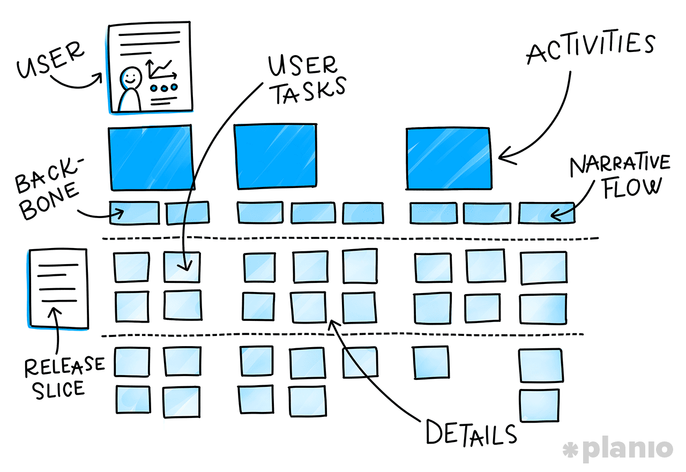
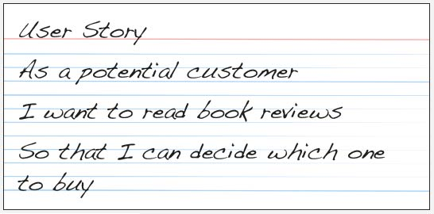
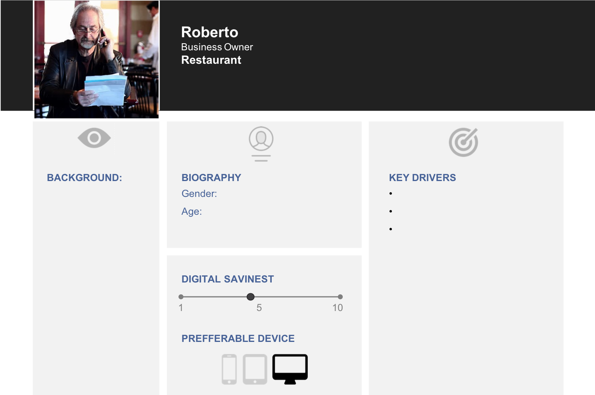
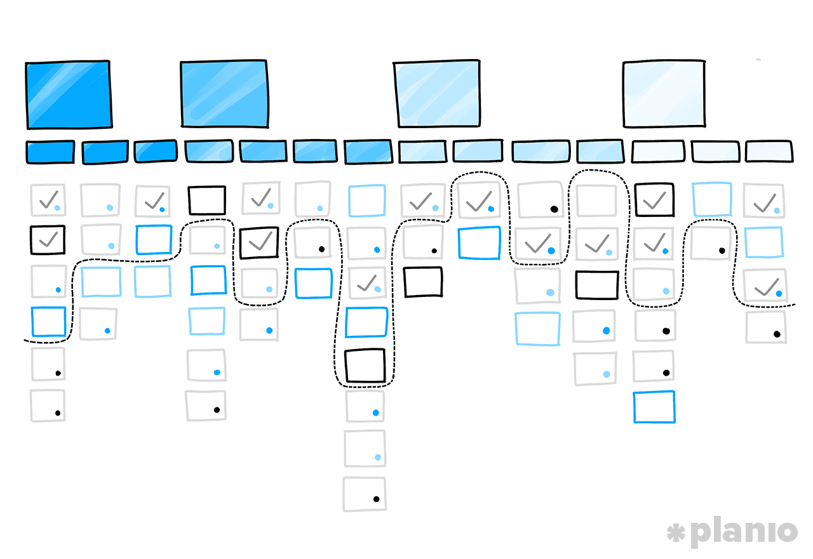

---
# Page settings
layout: default
head_title: Unit 2 Chapter 1
keywords:
comments: false

# Hero section
title: Chapter 1 User Stories
description: In this chapter you will learn how to define the users of your app and set the requirements for the software based on their stories.

# Micro navigation
micro_nav: true

# Page navigation
page_nav:
    prev:
        content: Unit 2
        url: '/u2/'
    next:
        content: Project 1
        url: '/u2/p1/'
---

# Defining Users
Good software should always start with the user. You app or software can't be sucessful unless you are able to meet the needs of its user. There are many strategies for getting into the shoes of the user. We will use some of these techniques, but realize that the most important thing is understanding the user. The techniques may change, but the central importance of the user will not.

<small>Source: [https://plan.io/blog/user-story-mapping/](https://plan.io/blog/user-story-mapping/)</small>

<small>Source: [https://www.emergn.com/blog/write-great-user-stories/](https://www.emergn.com/blog/write-great-user-stories/)</small>

# User Personas
Personas let you get into the skin of your user. Being able to empathize with your user is critical as you begin to develop to meet their needs. Failure to understand your user will lead to failure of your software.

<small>Source: [Kateřina Mňuková](https://medium.com/@katerina_mnuk/user-story-mapping-tips-and-tricks-dea4e2ffbae4)</small>

# Story Mapping

Story maps help structure your software using the story as the basis. Tasks are divided up in to release slices, which prioritize the order of development.

<small>Source: [https://plan.io/blog/user-story-mapping/](https://plan.io/blog/user-story-mapping/)</small>

<a href="story_mapping.pdf" class="btn btn--dark btn--rounded" >Story Mapping Guide</a>

# Divide and Conquer

Choose one video below to watch in its entirety. Take notes on the key points from the video. Get with the other members in your group and share what you've learned. You are responsible for sharing insights from your video to build the groups understanding. Be sure you discuss when your sources disagree or define things differently.

<iframe style="max-width: 640px;" width="100%" height="360" src="https://www.youtube.com/embed/k_4SchJgAI4" frameborder="0" allow="accelerometer; autoplay; encrypted-media; gyroscope; picture-in-picture" allowfullscreen></iframe>

<iframe style="max-width: 640px;" width="100%" height="360" src="https://www.youtube.com/embed/eYZ8vBXL1kk" frameborder="0" allow="accelerometer; autoplay; encrypted-media; gyroscope; picture-in-picture" allowfullscreen></iframe>

<iframe style="max-width: 640px;" width="100%" height="360" src="https://www.youtube.com/embed/Fw98L-kcRpc" frameborder="0" allow="accelerometer; autoplay; encrypted-media; gyroscope; picture-in-picture" allowfullscreen></iframe>
