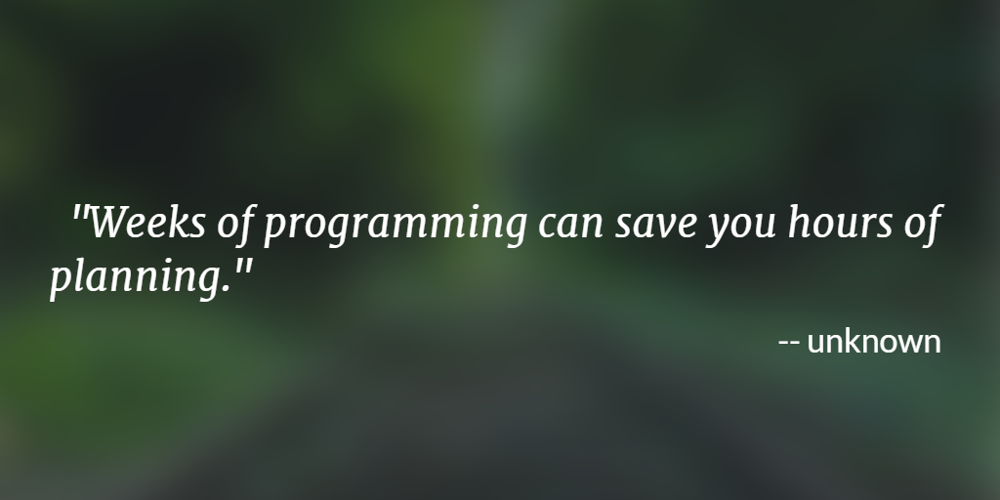

---
# Page settings
layout: default
head_title: Unit 2
keywords:
comments: false

# Hero section
title: Unit 2 SDLC - Requirements
description: >
    In this unit you will learn different ways to set the requirements for a software project. You will repeat this process several times in this course.

# Micro navigation
micro_nav: false

# Page navigation
page_nav:
    next:
        content: Chapter 1
        url: '/u2/c1'
---

# Overview

Software development begins with a solid plan. Sometimes when you are working on a personal project, you can get away with skipping planning. However, when you are working on a collaborative project for a client, it is necessary to carefully define the requirements for the software and ensure you understand the software you are setting out to build. 

## Table of Contents

| Chapter             | Description                                                                                   |
| ------------------- | --------------------------------------------------------------------------------------------- |
| [**Chapter 1**](c1) | Understand how to define users and their stories to set the specifications for your software. |
| [**Project 1**](p1) | Collaborate with your team to identify the users of your software and define their stories.   |

## Objectives

- Define the requirements for a client's software project.
- Analysize the client's need and define the software requirments accordingly.
- Define users and their stories in order to understand requirments.
- Develop a system to track project process towards completing requirments.

## TN Standards

- Research common and best-practice techniques in programming analysis, design, and implementation. Drawing on model practices used by businesses and industry, employ analysis, design, and implementation techniques to satisfy a programming need, using an appropriate software lifecycle model. **[Standard 6]**
- Employ a requirement management tool during a program’s development life cycle, documenting the evolving versions, storage attributes, system elements, status tracking, and access permissions afforded by the tool, as well as the successful attainment of the project vision. **[Standard 7]**