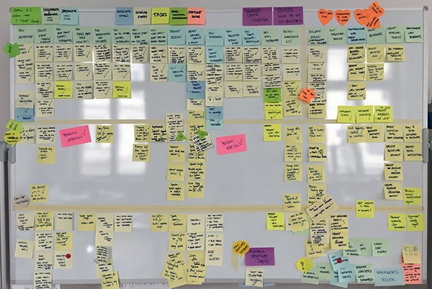

---
# Page settings
layout: default
head_title: Unit 2 Project 1
keywords:
comments: false

# Hero section
title: Project 1 User Story Map
description: In this project, you will collaborate with your team to identify the users of your software and define their stories.

# Micro navigation
micro_nav: true

# Page navigation
page_nav:
    prev:
        content: Chapter 1
        url: '/u2/c1'
---

# Overview

The goal of this project is to create a story map for your team's software project. You will build a physical User Story Map that will define the requirements for your team's project. Use the documents provided my me in class to help you think through your User's story. Remember this is a discussion that should happen with your team. The board is the product of that discussion.

<small>Source: [Alexandru Bolboaca](https://mozaicworks.com/blog/3-uses-story-maps-build-better-product/)</small>

# Deliverables

  
<strong><b>Deliverable</b> - User Story Map</strong>

  
Build a physical board to map your users and their stories. You may use markers, sticky notes, and anything else to help setup your board. Collaboration is important to successfully creating your board. Everyone should understand the requirements, so the conversations are more important that the physical board.

  
<strong><b>Deliverable</b> - Blog Post Reflection</strong>

  
Create a new blog post for your developer blog that reflects on your experience creating the User Story Map. Include photos of your physical board. Reflect on how you collaborated as a team. What was your contributions - be specific? Why are tools like user stories and user story maps important to developing software?

