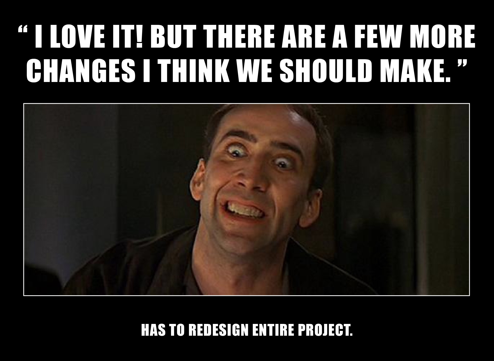

---
# Page settings
layout: default
head_title: Unit 3
keywords:
comments: false

# Hero section
title: Unit 3 SDLC - Design
description: >
  In this unit you decompose the project's requirements and begin designing solutions to meet those requirements.

# Micro navigation
micro_nav: false

# Page navigation
page_nav:
  next:
    content: Chapter 1
    url: "/u3/c1"
---

# Overview

Software development begins with a solid plan. Sometimes when you are working on a personal project, you can get away with skipping planning. However, when you are working on a collaborative project for a client, it is necessary to carefully define the requirements for the software and ensure you understand the software you are setting out to build.

## Table of Contents

| Chapter             | Description                                                         |
| ------------------- | ------------------------------------------------------------------- |
| [**Chapter 1**](c1) | Learn about project management tools like Kanban boards.            |
| [**Project 1**](p1) | Create a Kanban board for your collaborative.                       |
| [**Project 2**](p2) | Create a wireframe and data diagram for your collaborative project. |

## Objectives

- Develop a system to track project process towards completing requirments.
- Analyze requirements and create a wireframe of user interface.
- Analyze requirements and create a entity-relationship diagram.

## TN Standards

- Research common and best-practice techniques in programming analysis, design, and implementation. Drawing on model practices used by businesses and industry, employ analysis, design, and implementation techniques to satisfy a programming need, using an appropriate software lifecycle model. **[Standard 6]**
- Define the specifications of the data management plan, including variables (naming, scope, and types), validation measures (to protect the data from corruption), and data handling (storing, input/output, and back-up). For example, programs handling historical temperature data would be best suited to floating point values stored in multidimensional arrays, written to permanent storage, and displayed with limited precision. **[Standard 10]**
