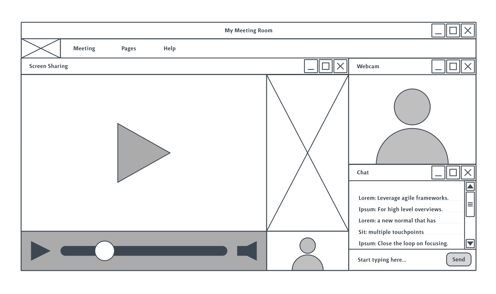
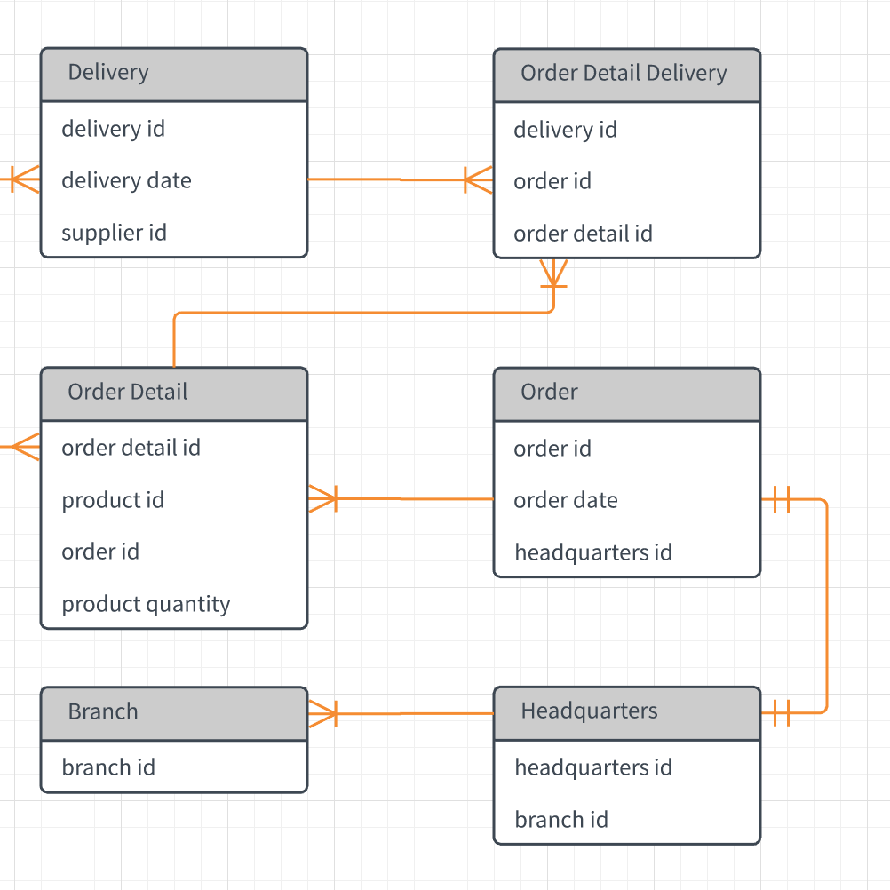
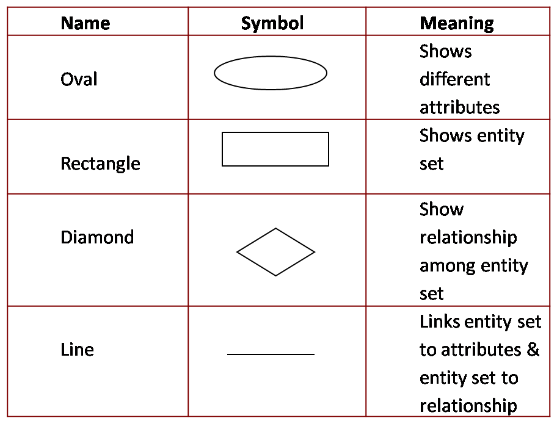

---
# Page settings
layout: default
head_title: Unit 3 Project 2
keywords:
comments: false

# Hero section
title: Project 2 Wireframes and Data Maps
description: "In this project, you will work together to design two important aspects of your software: user interface and data models"

# Micro navigation
micro_nav: true

# Page navigation
page_nav:
  prev:
    content: Project 1
    url: "/u3/p1"
---

# Overview

The goal of this project is to create the initial design for your user interface and the data model. These will likely change as you begin the development phase of the Agile software development lifecycle, but these documents will allow your team to have a starting point for conversations.

# Wireframes

A wireframe is a simplified layout for your userinterface. Think about applications you use every day. Are there any patterns that you can utilize to allow your user have an easier time working with your software? How will your user's needs be met physically by the interface?

<small>Source: Lucidchart</small>

<a href="https://www.experienceux.co.uk/faqs/what-is-wireframing/" class="btn btn--dark btn--rounded">Wireframing Guide</a>

<a href="https://medium.com/@konstantin.muenster/how-to-plan-and-organize-a-react-project-by-building-a-weather-app-95175b11bd01" class="btn btn--dark btn--rounded">Planning React Components</a>

# Entity Relationship Diagram

An ER diagram is a way to model data stored by your application.

<small>Source: Lucidchart</small>

<small>Source: bcastuff.blogspot.com</small>

# Deliverables

  
<strong><b>Deliverable</b> - Wireframe</strong>

  
Create the wireframes for the major interaces you will be working with on your application. Add print outs of the wireframes to your project board and Kanban board.

  
<strong><b>Deliverable</b> - Entity Relationship Diagram</strong>

  
Develop an ER diagram to model the data that you will store in your application. Add print outs of your ER diagram to your project board. and Kanban board.

  
<strong><b>Deliverable</b> - Blog Post Reflection</strong>

  
Add to your previous blog post on Kanban Boards. Include screenshots and photos. Reflect on why developers use tools like wireframes and er diagrams. How could you use this two tools moving forward on your Capstone project?

