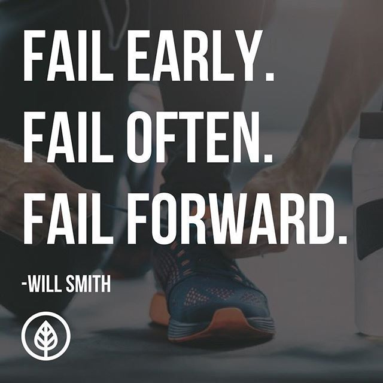
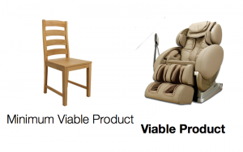
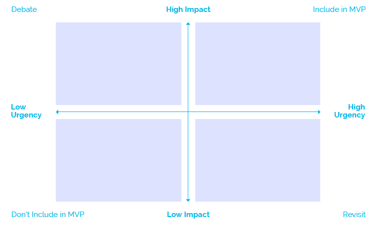

---
# Page settings
layout: default
head_title: Unit 3 Chapter 1
keywords:
comments: false

# Hero section
title: Chapter 1 Minimum Viable Product
description: In this chapter you will learn about MVPs and the value they provide to developers.

# Micro navigation
micro_nav: true

# Page navigation
page_nav:
  prev:
    content: Unit 4
    url: "/u4/"
  next:
    content: Project 1
    url: "/u4/p1/"
---

# Minimum Viable Product

> **“What if we found ourselves building something that nobody wanted? In that case what did it matter if we did it on time and on budget?”** **–Eric Ries**

When you first start creating your software it will be messy and the goal is not to build the final product. Rather your goal should be to build the minimum necessary to have a working product. This is important because you need to get your software in the hands of users as soon as possible. There is nothing worse than to spend months working on something only to discover that it was the wrong solution.

You will have failures as you start to build your software. This is **normal** at any point during the development process. Make it your goal to fail forward. You can let a failure move you backwards, or it can become the stepping stone to the next step in your project.

# What is an MVP?

The minimum viable product is a working product, but it doesn't have all the bells and whistles necessary for the final product. It should function on some level even if all features are not implemented.

 
<small>Source: [Hackernoon](https://hackernoon.com/the-ultimate-guide-to-minimum-viable-product-59218ce738f8)</small>

One key idea with an MVP is that users need to be able to "use" your software. When your MVP is complete you will put it in the hands of your users and let them provide you feedback. This will provide tremendous information that will fuel your next cycle of development.

<small>Source: [Hackernoon](https://hackernoon.com/the-ultimate-guide-to-minimum-viable-product-59218ce738f8)</small>

# What should go in the MVP?

Sometimes it's difficult to determine what should go into an MVP. Doing a quick analysis like the one below can help your team zero in on the features that are essential and need testing.

