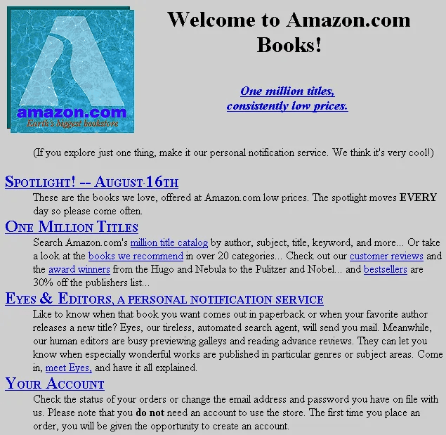
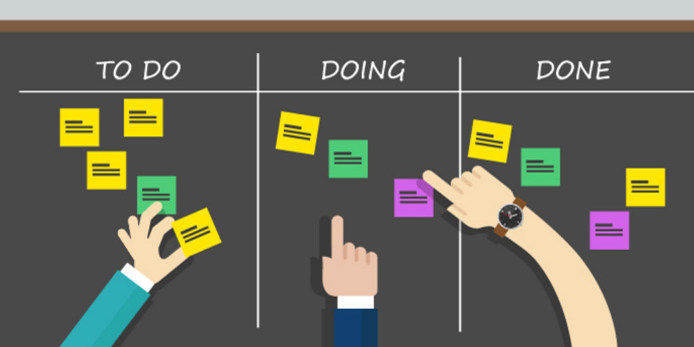

---
# Page settings
layout: default
head_title: Unit 3 Project 1
keywords:
comments: false

# Hero section
title: Project 1 MVP
description: In this project, you will collaborate with your team to create your Minimum Viable Product.

# Micro navigation
micro_nav: true

# Page navigation
page_nav:
  prev:
    content: Chapter 1
    url: "/u4/c1"
---

# Overview

All software projects have to start somewhere. Even big names like Apple or Amazon had rough products to start with. You will work with your team to build a working prototype of your application. It needs to be usable so that you can do testing in the next stage.

# Managing the Project

Use the tools you've worked on in the previous stages to manage your project. The key is to use the design and requirements to manage the output of your development cycle.

# Deliverables

  
<strong><b>Deliverable</b> - MVP</strong>

  
Build a Minimum Viable Product that can be tested by the end of our first development sprint. You will submit all code through GitHub, and you will be assessed on your commit messages, pull requests, and code contribution.

  
<strong><b>Deliverable</b> - Blog Post Reflection</strong>

  
Create a new blog post for your developer blog reflects on the first and second week of development. Reflect on the process, collaboration, and your choices of development approaches (i.e. data-driven, top-down, bottom-up, ect.).

